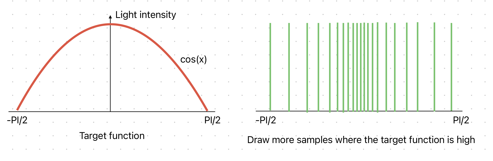
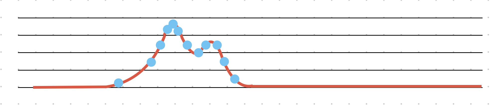

# Notes and warnings

The following pages describe the current state of the "gi" pass FX. To highlight which aspects of the algorithm don't work or could be improved, i'll be using these visual references:

>[!NOTE]
> Notes are used to indicate the "reasons why" i made certain choices.

>[!WARNING]
> Warnings are used to indicate parts of the algorithm which are not currently working, or some things that may be worth trying in my opinion.

By the end of this guide/article/whatever, i'll summarize in the same place all the critical aspects that need some further work.

# Some necessary info and annoying math about importance resampling, reservoirs and ReSTIR

Here i'm collecting some concepts fundamental for understanding the ReSTIR algorithm and some useful links to go deeper into the subject. I try to keep it short, but i'm sure i'll fail.

ReSTIR can be a bit complex at first (it took me some time to fully grasp its workings), but once you understand it, you'll appreciate how elegant and well-designed the algorithm is. If you're already familiar with concepts like importance sampling, RIS, reservoirs, and the basic mechanics of ReSTIR, feel free to skip this first page.

## Importance sampling

We all know this guy:

$$
L_o(\mathbf{x}, \omega_o) = L_e(\mathbf{x}, \omega_o) + \int_{H^{2}} f_r(\mathbf{x}, \omega_o, \omega_i) L_i(\mathbf{x}, \omega_i) \cos(\theta_i) d\omega_i
$$

There's no computable solution to the rendering equation, but we can estimate its result. To estimate it, we can raytrace from a point on a surface in random directions and collect radiance samples - averaging the light contributions, we can estimate the solution to the rendering equation.
The problem with this approach, is that of all the taken samples, not all of them are "important", as many won't bring much light to the pixel being shaded. If we can afford few samples per frame, it would be better to make the best out of the available resources.

Importance sampling is about shooting rays where it really matters.

There are two ways to (statistichally) know if a certain light direction is important:
- the BRDF (or BSDF) of the surface being shaded
- The relative position of light sources with respect to the point being shaded.

### Importance sample the BxDF 

Given a certain BxDF, we know that the light direction affects the amount of light reflected by a surface. To make an example, consider the diffuse component computation in these two scenarios:


The point on the left reflects more light than the point on the right, because the cosine of the angle formed by the normal vector and the light direction is smaller. Knowing this, we could concentrate the random ray directions towards the aphex of the hemisphere where it is more likely to find important light sources. This is called cosine-weighted importance sampling.


When determining how to shoot rays, we rely on a PDF (probability density function). Examples of PDFs include uniform sampling and cosine-weighted sampling. The PDF defines the likelihood of shooting a ray in a specific direction.

When samples are drawn from a non-uniform PDF, rays tend to cluster, with some directions being sampled more frequently than others. To account for this bias, the radiance from any given direction must be divided by the likelihood of selecting that direction. For example, this is how the lambertian component is computed in a ray-traced context:

```glsl
// compute diffuse component for uniform PDF

float lambert = max(0.0, normal, light_direction)); //cosine N.L
float PDF = 1 / M_TWOPI; //Uniform sampling PDF weight
vec3 diffuse_radiance = albedo * lambert * light_color / PDF;										
```

```glsl
// compute diffuse component for cosine-weighted PDF

float cosine = max(0.0, normal, light_direction)); //cosine N.L
float PDF = cosine / M_PI; //cosine-weighted PDF weight
vec3 diffuse_radiance = albedo * cosine * light_color / PDF;										
```
>[!NOTE]
> Cosine-weighted PDF is cool also because the cosine term cancels out nicely, and can be rewritte like:
```glsl
// compute diffuse component for cosine-weighted PDF

//cosine = max(0.0, normal, light_direction)); //cosine N.L
//PDF = cosine / M_PI; //cosine-weighted PDF weight
//albedo * cosine * light_color / PDF;	
vec3 diffuse_radiance = M_PI * albedo * light_color;										
```

As long as we account for certain directions being sampled more often than others, any PDF covering the hemisphere makes the rendering equation converge. Still, some distriubutions make the render converge faster than others.

### Importance sampling light sources

If there’s a bright light source on the right and nothing on the left, shooting a ray to the left is essentially wasted effort. Importance sampling is not just about favoring directions that inherently carry more energy due to the BxDF; it’s also about directing rays more frequently toward significant light sources. However, this introduces additional challenges. To precisely identify the most relevant light sources, we would first need to solve the rendering equation—putting us back to square one. Simply ranking light sources by intensity isn’t sufficient either, as some light sources may be occluded or their contributions diminished by albedo modulation. There’s no universal way to determine which light sources are most important (e.g., an intense blue light source with values like (0,0,50) contributes nothing to a surface with an albedo of (1,1,0)).

Let’s revisit why importance sampling the BxDF works. Considering the diffuse component of the BRDF, we know that light sources directly above a surface contribute more to its illumination than those at shallow angles. This relationship is well-defined because there is an analytical function— 𝑁⋅𝐿 —that describes light intensity as a function of angle. To importance sample the diffuse BRDF, we can generate random samples proportional to this function. The target function is known, and the PDF we use for generating samples must mirror the shape of the target function (they must have the same profile when plotted). Therefore, importance sampling is most effective when the chosen PDF closely matches the target function, as in the case of using a cosine-weighted PDF for the diffuse BRDF.



This is straightforward for the diffuse lobe, as it is known in advance. But what if we need to importance sample something less predictable, like light sources we know little to nothing about? In other words, how can we create a PDF that aligns with a target function we have no prior knowledge of?

This is where Resampled Importance Sampling (RIS) comes into play.

## Resampled Importance Sampling (RIS)

Resampled Importance Sampling (RIS) is a method for constructing a PDF to importance sample an unknown target function. It forms the basis of the ReSTIR algorithm.

The core concept is that, given a very large pool of low-quality samples, you can intelligently select a smaller subset from this pool to produce a set of higher-quality samples.

Algorithmically, this means:

1) First, use a cheap, or naive, algorithm to generate a large number of samples 𝑆𝑖
2) Second, pick a subset of 𝑆𝑖 to create a new set of samples 𝑅𝑗 assigning a weight to each of them to "score" how important they are
3) Use samples 𝑅𝑗 for your rendering.

This is called “resampling” because you pick your final samples 𝑅𝑗 by re-evaluating weights for your earlier samples 𝑆𝑖
 and picking a subset of them. (I.e., every 𝑅𝑗 is also a sample 𝑆𝑖)

Example:

Imagine you are rendering a scene with an LED strip, where each individual LED varies in intensity. Here’s how RIS would approach this problem:


The graph above illustrates the intensity of the LEDs along the strip—most of the strip is dark, with only a bright region on the left.

To importance sample this target function, samples should be drawn in proportion to its intensity, resulting in a distribution that might look like this:



where more samples are drawn where the function in high, fewer where it's low, none where it's zero. But we know the led strip intensity because we're omniscent; what if we don't know anything about it but still need to find a PDF that matches the target function? This is how to do it with RIS:

1) Start with a simple and uniform PDF. The goal is to turn this simple PDF into a more complex PDF that matches the target function. Start by generating uniformly distributed random samples from the simple PDF. Being uniform, the PDF from which we're drawing our samples has a weight of 1 everywhere. (Any initial PDF can be used; for the sake of simplicity, i'm using a uniform samples distribution in this example)


2) Sample the scene, and assign a weight to each sample - weighting samples can be performed in a variety of ways, but let's say we simply compute the luminance of the samples, ending with a single value representing how bright a sample is. This brightness value is a weight assigned to the samples in the complex PDF.


Here, spheres' radius is used to represent samples' weights.

3) Divide the weight of the sample in the complex PDF by the weight of that sample in the simple PDF; being the simple PDF uniform, we divide the weight by 1, which leaves us with simply the weight of the sample in the complex PDF. Brighter samples will have higher weights than darker ones.


4) Here starts the "rendering" part: Pick a random sample from the complex PDF - higher weighted samples are more likely to be choosen. A sample with weight = 3 is three times more likely to be choosen than a sample of weight = 1. 
5) The radiance emitted by the choosen sample must be divided by the weight that the sample has in the complex PDF. The division by weight compensates for some regions being sampled more often than others.
6) Lastly, we need to multiply radiance by the average weight of all the samples; this compensates for the fact that we're taking a limited number of samples, and makes the complex PDF coincide with the target function we're sampling.

Using math symbols:

1) $x_1, x_2, ..., x_m$ -> samples from the simple PDF (uniform)
2) $w(x) = \frac{complexPDF(x)}{simplePDF(x)}$ -> assign a weight to sample x
4) $y \sim w$ -> draw sample y proportional to w
5) $e = f(y)$ -> compute radiance e from sample y
6) $e_w = \frac{ \frac{1}{m} \sum_{i=1}^{m} w(x_i) }{complexPDF(x)}$ -> scale radiance by average samples' weight divided by this sample's weight in the complex PDF

Where does the performance advantage lie in generating many samples and then resampling them? If we need to generate many samples to estimate which matter the most, can't we render from these samples directly? The benefit comes from the ability to simplify certain aspects when assigning weights to the samples. For example, instead of factoring in visibility (which involves expensive ray-tracing operations), weights can be estimated based on the unshadowed contribution of the samples. RIS enables a "coarse" selection of the most promising candidates, allowing the rendering part of the algorithm to focus sampling efforts where it (should) matter the most.

(Refer to these links for a clearer in-depth explaination: 
https://www.youtube.com/watch?v=gsZiJeaMO48&t=416s , 
https://cwyman.org/blogs/introToReSTIR/introToRIS.md.html#:~:text=Resampled%20importance%20sampling%2C%20or%20RIS,thesis%20from%20Brigham%20Young%20University. )

With RIS, we can draw a bunch of random samples, compute a cheap estimate of their importance, and then resample these samples, with higher weighted samples being more likely to be selected. 
But how exaclty can we perform this weighted random selection efficiently?

## The Reservoirs

After the RIS process, we obtain a large set of weighted samples, and the next step is to perform a weighted random selection from them. However, storing such a large number of samples can be challenging. This is where reservoir sampling comes into play — a technique that allows for this type of selection without requiring significant memory or prior knowledge of the total number of samples.

Reservoir Sampling is a randomized algorithm for selecting a sample of 𝑘 items from a larger population of 𝑁 items, where 𝑁 is unknown or too large to fit into memory. Reservoir sampling allows you to stream a list of data and choose an item from the list as you go. This also works when you want to choose items in the list with different probabilities, which is key for importance sampling. 

A reservoir is a data structure used to perform this selection. You can throw any number of samples into a reservoir, and perform a weighted random selection on them. 

Please, refer to these links for an in-depth explanation of how reservoir sampling works:
https://www.youtube.com/watch?v=A1iwzSew5QY , 
https://blog.demofox.org/2022/03/01/picking-fairly-from-a-list-of-unknown-size-with-reservoir-sampling/ )

A reservoir contains 4 things:

- the sum of all the weights; when a new sample is thrown into a reservoir, its weight is added to the total weight.
- the index of the chosen sample; the reservoir holds the index of the selected sample.
- the number of samples contained in the reservoir; for every new sample added to the reservoir, this value is increased by 1.
- the weight of the current sample; This is needed to perform steps 5 and 6 of the RIS algorithm.

Here’s how reservoir sampling works:

- Start with an empty reservoir and insert the first sample into it.
- For each new sample, perform a weighted random selection between the sample currently in the reservoir and the new sample being added. The weights for this selection are determined by the weight of the new sample compared to the running sum of the weights of all samples processed so far.
- Flip a "coin" (based on the weighted probabilities) to decide whether to keep the current sample in the reservoir or replace it with the new one.
- Regardless of the outcome, add the weight of the new sample to the running total of weights.

Here’s a GLSL-like pseudo-code function to integrate new samples into the reservoir:

```glsl
void updateReservoir(inout vec4 reservoir, float newSampleIndex, float newSampleWeight)
{
	//reservoir.x = running sum of all the weights seen so far
	//reservoir.y = index of the current sample kept in the reservoir
	//reservoir.z = number of samples added so far
	//reservoir.w = weight of the current sample

	reservoir.x += newSampleWeight; //add the new sample's weight to the running total of weights 
	reservoir.z += 1; // add 1 to the number of samples thrown into the reservoir so far

	//perform the weighted random coin flip
	if (RandomFloat01() < newSampleWeight / reservoir.x) {
		reservoir.y = newSampleIndex; //substitute the old sample with the new one
		reservoir.w = newSampleWeight; //update the weight of the current sample
	}	
}									
```

Reservoirs also have a fantastic property: they can be combined! If you have two ore more reservoirs and you want to combine them, you don't have to put all the individual samples that got processed by the reservoirs we're combining; you just have to take the current sample in each reservoir, and add it to the combined reservoir, togheter with the length of the reservoirs we're combining.

```glsl
void combineReservoirs(inout vec4 reservoir, in vec4 reservoirToCombine)
{
	//reservoir.x = running sum of all the weights seen so far
	//reservoir.y = index of the current sample kept in the reservoir
	//reservoir.z = number of samples added so far
	//reservoir.w = weight of the current sample

	reservoir.x += reservoirToCombine.w * reservoirToCombine.z; //add the new sample's weight to the running total of weights scaled by how many samples are contained in reservoirToCombine
	reservoir.z += reservoirToCombine.z; // add the length of reservoirToCombine to the total number of samples thrown into the reservoir so far

	//perform the weighted random coin flip
	if (RandomFloat01() < reservoirToCombine.w * reservoirToCombine.z / reservoir.x) {
		reservoir.y = reservoirToCombine.y; //substitute the old sample with the new one
		reservoir.w = reservoirToCombine.w; //update the weight of the current sample
	}	
}								
```

This property of reservoirs is what makes ReSTIR possible.

## ReSTIR (Reservoir-based Spatio-Temporal Importance Resampling)

ReSTIR is an algorithm aimed at finding very quickly the most important light samples for each rendered pixel.

- "Importance Resampling" because it's based on RIS.
- "Reservoir-based" because it uses reservoir sampling to perform weighted random selection of the samples selected by RIS.
- "Spatio-Temporal" because it combines reservoirs from neighboring pixels (spatial) and from past frames (temporal) to select among a massive amount of candidate samples very quickly.

This is a breakdown of how ReSTIR works:

1) Gather a random sample - The sampling strategy depends on the context in which ReSTIR is used - in full fledgeg ray tracing rendering, samples are taken by raytracing the scene geometry. The PDF used for drawing these initial samples can be anything, althoug the original ReSTIR paper suggests using uniform sampling.

2) Assign a weight to the sample - The weighting is performed considering the BxDF of the shaded point, its albedo value, and the sample's color (in ReSTIR used for computing direct illumination, the squared distance from the shaded point to the sample is also taken into account). Weighting is perfomed as follows:

$$
	e = x_{alb} * f_r(\mathbf{x}, \omega_o, \omega_i) L_i(\mathbf{x}, \omega_i) \cos(\theta_i) / PDF
$$

$$
	e_w = \lVert e \rVert
$$

where $e$ is the radiance, $e_w$ is the samples's weight, $x$ is the shaded point, $x_{alb}$ is the albedo of the shaded point, $f_r(\mathbf{x}, \omega_o, \omega_i)$ is the BxDF of the shaded point, and $L_i(\mathbf{x}, \omega_i)$. The weight corresponds to the length of the radiance vector.

3) Once the weight has been computed, the sample is inserted into the a reservoir. Each pixel contains a reservoir storing the candidate samples. Repeat steps from 1 to 3 if you need to increase the initial pool of samples. Typically only one sample is taken because ray tracing operations are by far the most costly.

4) Temporal reuse of the reservoirs - the current reservoir is combined with the previous frame reservoir. Combining reservoirs temporally allows for iteratively refining the sampling PDF. Before combining the current and previous reservoir, the previous reservoir must be validated: a shadow ray is traced from the shaded point to the sample stored in the previous reservoir to check if it's still visible in the current frame. If it is, the reservoirs are combined, otherwise, the previous frame reservoir is discarded.

5) Spatial reuse of the reservoirs - neighboring reservoirs might contain just-as-good samples as the current reservoir; This reservoir is then combined with the neighboring reservoirs, under the assumption that given the closness of the reservoirs, the candidate samples stored by neighbors are visible from the shaded point.

6) Resolve the reservoir - The sample that "survided" reservoir sampling is used to render illumination for the shaded point.

The strength of ReSTIR lies in its ability to gather a large number of samples at the cost of just 2 ray tracing operations: one ray to gather the sample, one ray to validare the history samples. To put it into numbers:

- frame 1: gather 1 sample, no history available, add 8 (8x1) samples from neighbors = 9 samples
- frame 2: gather 1 sample, 9 samples available from history, add 80 (8x10) samples from neighbors = 90 samples
- frame 3: gather 1 sample, 90 samples available from history, add 728 (8x21) samples from neighbors = 819 samples
- frame 4: gather 1 sample, 819 samples available from history, add 6560 (8x820) samples from neighbors = 7380 samples

and so on... In the time span of just 4 frames, at the cost of 2 rays per pixel, we can actually select among 7380 importance sampled samples for rendering (CRAZY!!).

This is the origianl formulation of the ReSTIR algorithm. Many shortcuts are possible, and the Jitter implementation, as well as other implementations available online, cut some corners, especially concerning history validation. In the next paragraphs i'll detail how ReSTIR has been implemented and adapted in the "gi" pass FX.