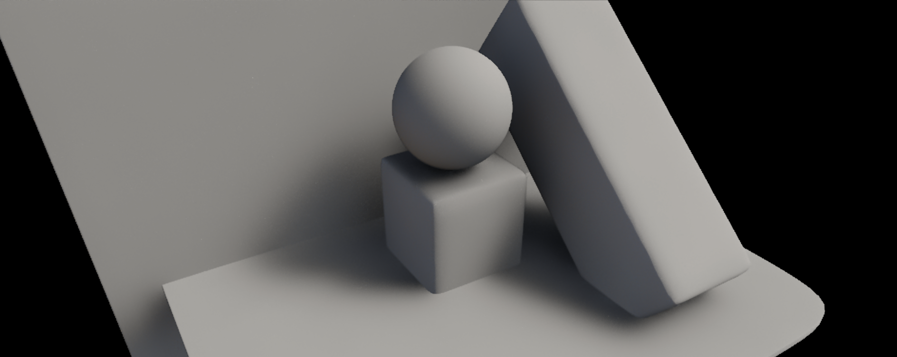
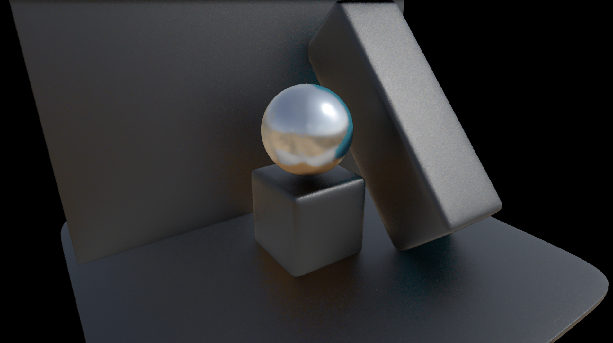

# The “gi” pass FX

The "gi" pass FX calculates global illumination by gathering light contributions in screen space using ray marching. It also supports material-aware lighting effects and utilizes environment maps for image-based lighting (IBL).

## Algorithm Overview

The "gi" pass computes indirect lighting and IBL using deferred rendering. Direct lighting is handled separately with jit.gl.pbr shading and shadow mapping, and this output is provided to the pass as a source for indirect illumination.

To gather light samples, the algorithm casts rays in screen space. Its primary objective is to compute global illumination while minimizing the number of samples required. This efficiency is achieved through ReSTIR (Reservoir-based Spatio-Temporal Importance Resampling), which reuses significant light paths across space and time. By leveraging ReSTIR, the algorithm reduces sample counts while maintaining a good (albeit biased) approximation of the rendering equation with fast convergence.

Indirect lighting is split into two components: diffuse and specular lighting. Each component processes independently using the ReSTIR framework and is combined later in the algorithm. During each frame, a single light bounce is computed, but the results are fed into subsequent frames, enabling multiple bounces to be calculated progressively over time.

The "gi" pass also considers the BRDF (Bidirectional Reflectance Distribution Function) of the illuminated surfaces. It integrates with jit.gl.pbr to access surface roughness and metalness values. These surface properties influence the lighting calculations, affecting both the light transport functions and the sampling distributions used for generating rays.

## Anatomy of the "gi" pass


### "gi" pass inputs

The "gi" pass relies on many inputs; some of them are the render targets, wheter taken directly or after some processing, some others are the result of the previous frame reprojected onto the current one.

#### The render targets

- Color buffer: it contains the image as rendered in the forward phase. It includes direct illumination + shadows.
- Normals + depth: it contains view-space normals and normalized depth (= length(view-space-position)/far_clip ).
- Velocity buffer: it contains screen-space velocity vectors, encoded as red = horizontal_velocity, and green = vertical_velocity.
- Albedo buffer: it contains the albedo color as processed by jit.gl.pbr.
- Roughness and metalness buffer: it contains the roughness and metalness values as processed by jit.gl.pbr in the red and green channels respectively
- 4 layers of depth: it contains four layers of depth (view-space.z) obtained through depth peeling. R = closest front face depth; G = closest back face depth; B = second closest front face depth; A = second closest back face depth. Having 4 depth layers improves the accuracy of screen-space ray marching.

#### Velocity inflation and disocclusion weights

Velocity vectors are used to temporally reproject data from the previous frame onto the current frame. Temporal reprojection serves two key purposes: enabling the temporal reuse of reservoirs and supporting temporal filtering. Since velocity vectors are tied to the geometry that generates them, even minor inaccuracies can result in faulty reprojections at shape edges, leading to ghosting artifacts.

To mitigate this, velocity vectors are "inflated," extending them over the shape they belong to. This inflation is achieved by examining 2x2 tiles and selecting the velocity vector with the highest magnitude within each tile.

>[!NOTE]
> Alternatively, the velocity vector could be chosen based on the closest fragment (i.e., the fragment with the smallest depth value) within the tile.

When objects move, new fragment may be disoccluded and appear on screen for the first time. To account for disoccluded fragments, a weight is assigned to each fragment representing how relieable is each velocity vector. Such computation is performed considering the fragment's velocity vectors, and the previous velocity vectors (the method is described in detail here: https://www.elopezr.com/temporal-aa-and-the-quest-for-the-holy-trail/).

```glsl
// Assume we store UV offsets
vec2 currentVelocityUV = texture(velocityTexture, uv).xy;
 
// Read previous velocity
vec2 previousVelocityUV = texture(previousVelocityTexture, uv + currentVelocityUV).xy;
 
// Compute length between vectors
float velocityLength = length(previousVelocityUV - currentVelocityUV);
 
// Adjust value
float weight = saturate((velocityLength - 0.001) * 10.0);
```

The weights are stored in the blu channel of the inflated velocity texture.
Weights are used to accept/reject temporal reprojections, and they're used both in the temporal reuse of the reservoirs and in temporal filtering.

#### Velocity vectors for reflections

Velocity vectors describe how a given fragment moves between frames. While they are ideal for temporally reprojection of reservoirs and colors (in the temporal filter) for the diffuse component, they are inadequate for reprojection of reflections. To compute reliable motion vectors for temporal reprojection of reflections, I’ve been exploring the method outlined in this paper -> https://sites.cs.ucsb.edu/~lingqi/publications/rtg2_ch25.pdf.

This approach requires retrieving the local transform for each reflected fragment, which is currently not feasible within the existing framework. I’ve been working to adapt or approximate the method to function without direct access to the local transform.

>[!WARNING]
> The solution I’ve devised appears to work to some extent, but there are still unresolved challenges in handling rough reflections and accounting for disocclusion weights. 

#### Downscaling

Each render target undergoes a downscaling process, reducing its texture size by half. These half-size render targets are utilized during sample collection and reservoir reuse. Downscaling is achieved by randomly selecting one pixel within a 2x2 tile. The same pixel is chosen across all render targets within the tile.

>[!NOTE]
> I experimented with several strategies for downsampling the render targets. Initially, I consistently chose the top-left pixel within each tile (and it's so in the currently released version of the pass FX). While functional, this resulted in noticeable jagged edges along shapes. Another approach involved averaging the pixel values within each tile (ensuring normal vectors were re-normalized), but this adversely affected ray-marching during depth comparisons. Randomly selecting a pixel within the 2x2 tile proved to be the most effective method. It enhances sample variance and acts as a form of "downscaled TAA" when the image undergoes temporal filtering.

#### Environment map

The "gi" pass can access the environment map provided via jit.gl.environment. When "gi" is instanciated, IBL computation gets disabled in jit.gl.pbr, and the light coming from the environment is computed in the pass instead.

#### Short-range AO

A short range ambient occlusion is computed ray marching through the 4 depth layers. Ambient occlusion is computed by taking 8 samples per frame within the hemisphere above the surface; Samples are distributed using blue noise. The AO isn't applied directly to the rendered image; rather, it's used to control the reservoir spatial reuse, and the ReSTIR resolve pass. More about that in the dedicated sections.

#### Previous-frame composited image

The result of the previous frame is reprojected onto the current frame and used as source for indirect illumination; This process allows for computing multiple light bounces across frames. Only the diffuse component is reprojected at the next frame (because is not view-dependent). Reflections are fed back only of the surface is metallic.

>[!NOTE]
> Reprojecting reflections allows for inter-reflections. The result isn't physically accurate, because reflections are striclty view dependent. Still, with metallic objects, non-correct inter-reflections look better than no inter-reflection...

# Diffuse



The indirect diffuse computation follows these main steps:

- Sample gathering (half-res)
- Temporal reuse of the reservoirs (half-res)
- First spatial reuse of the reservoirs (half-res)
- Second spatial reuse of the reservoirs (half-res)
- ReSTIR resolve (full-res)
- Temporal filtering (full-res)

## Sample gathering (half-res)

The indirect diffuse computation starts by gathering color samples. The gathering is performed in three ways:

### Gathering samples from the viewport

Random pixels are sampled from the Previous-frame composited image. The random distribution is uniform, and any pixel has the same propability of being sampled. If the sampled pixel is on the empty background of the rendered image, it's discarded.

>[!NOTE]
> We could ray-trace from the G-Buffer to find intersections with the on-screen geometry; since ReSTIR is all about postponing visibility checks, i'm currently collecting light samples from the texture directly, without worring about them being visible, and skipping costly ray-tracing operations. Visibility is checked only later on in the ReSTIR process. Moreover, the distribution of the samples within the hemisphere is supposed to be uniform, therefore, any points

### Gathering samples from the a selection of brightest pixels

# Reflections



# Compositing


