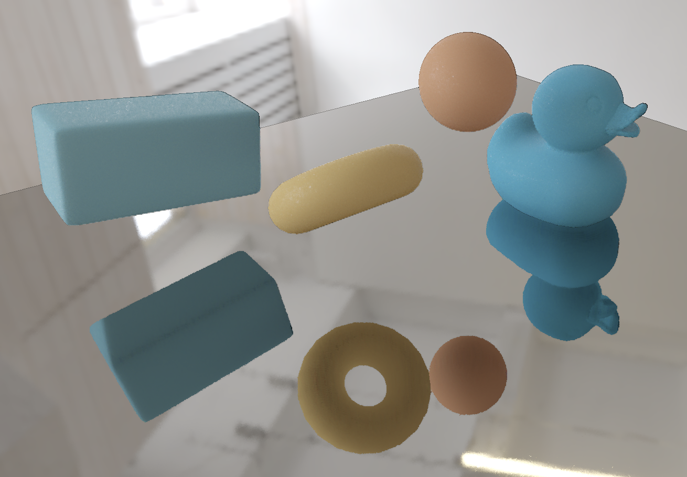
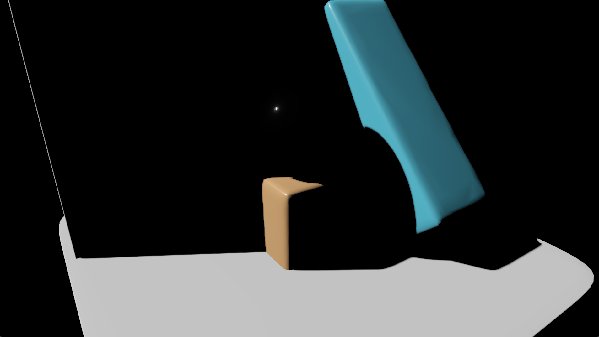
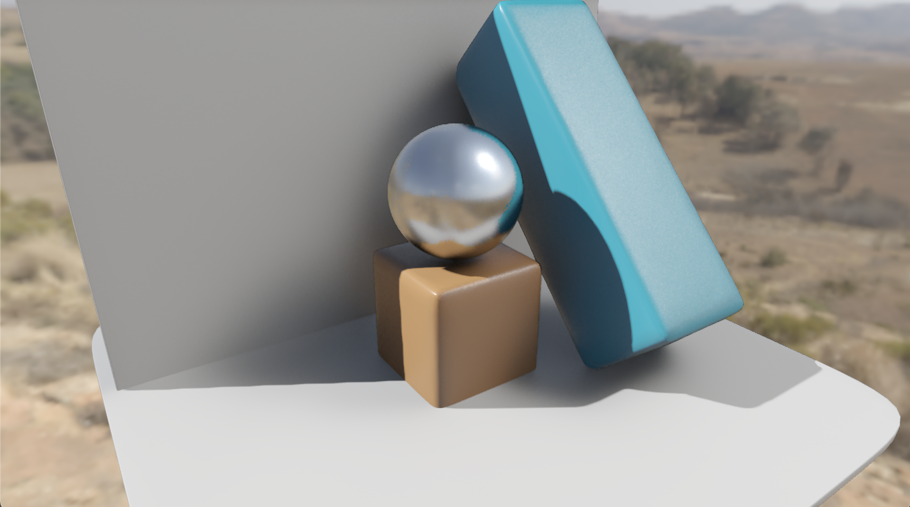

# The "gi" pass FX


The "gi" pass relies on many inputs; some of them are the render targets provided by jit.gl.pbr, whether taken directly or after some processing, some others are the result of the previous frame reprojected onto the current one.

## The render targets

- Color buffer: it contains the image as rendered in the forward phase. It includes direct illumination + shadows.
- Normals + depth: it contains view-space normals and normalized depth (= length(view-space-position)/far_clip ).
- Velocity buffer: it contains screen-space velocity vectors, encoded as red = horizontal_velocity, and green = vertical_velocity.
- Albedo buffer: it contains the albedo color as processed by jit.gl.pbr.
- Roughness and metalness buffer: it contains the roughness and metalness values as processed by jit.gl.pbr in the red and green channels respectively
- 4 layers of depth: it contains four layers of depth (view-space.z) obtained through depth peeling. R = closest front face depth; G = closest back face depth; B = second closest front face depth; A = second closest back face depth. Having 4 depth layers improves the accuracy of screen-space ray marching. The view-space Z position is represented by negative in Jitter.

Moreover, having 4 layers of depth improves the screen-space reflections look - typically, SSR can't be used to reflect what's not visible in the viewport, leading to faulty reflections of the objects back faces. The 4 depth layers allow to correctly reflect the objects back faces. The colors aren't correct (color are sampled from the front face), but the geometry is, and overall, IMHO it looks better than no reflection at all.


Example of back face reflections

## Velocity inflation and disocclusion weights

Velocity vectors are used to temporally reproject data from the previous frame onto the current frame. Temporal reprojection serves two key purposes: enabling the temporal reuse of reservoirs and supporting temporal filtering. 

Since velocity vectors are tied to the geometry that generates them, even minor inaccuracies can result in faulty reprojections at shape edges, leading to ghosting artifacts. To mitigate this, velocity vectors are "inflated," extending them over the shape they belong to. This inflation is achieved by examining 2x2 tiles and selecting the velocity vector of the closest fragment in the tile. (see restir.inflate_velocity.jxs)

When objects move, new fragment may be disoccluded or come from outside the viewport and appear on screen for the first time. To account for disoccluded fragments, a weight is assigned to each fragment representing how relieable is each velocity vector. Such computation is performed considering the fragment's velocity vectors, and the previous velocity vectors (the method is described in detail here: https://www.elopezr.com/temporal-aa-and-the-quest-for-the-holy-trail/).

```glsl
// Assume we store UV offsets
vec2 currentVelocityUV = texture(velocityTexture, uv).xy;
 
// Read previous velocity
vec2 previousVelocityUV = texture(previousVelocityTexture, uv + currentVelocityUV).xy;
 
// Compute length between vectors
float velocityLength = length(previousVelocityUV - currentVelocityUV);
 
// Adjust value
float weight = saturate((velocityLength - 0.001) * 10.0);
```

The weights are stored in the blu channel of the inflated velocity texture.
Weights are used to accept/reject temporal reprojections, and they're used both in the temporal reuse of the reservoirs and in temporal filtering. (see restir.get_velocity_and_weights.jxs)

## Velocity vectors for reflections

Velocity vectors describe how a given fragment moves between frames. While they are ideal for temporally reproject reservoirs and colors (in the temporal filter) for the diffuse component, they are inadequate for reprojecting of reflections. To compute reliable motion vectors for temporal reprojection of reflections, I’ve been exploring the method outlined in this paper -> https://sites.cs.ucsb.edu/~lingqi/publications/rtg2_ch25.pdf.

This approach requires retrieving the local transform for each reflected fragment, which is currently not feasible within the existing framework. I’ve been trying to adapt or approximate the method to function without direct access to the local transform.

>[!WARNING]
> The solution I’ve devised appears to work to some extent, but there are still unresolved challenges in handling rough reflections and accounting for disocclusion weights. 

## Downscaling

Each render target undergoes a downscaling process, reducing its texture size by half. These half-size render targets are utilized during sample collection and reservoir reuse. Using half-size textures accelerates ray marching operations drastically. Downscaling is achieved by randomly selecting one pixel within a 2x2 tile. The same pixel is chosen across all render targets within the tile. (see restir.downscale.jxs)

>[!NOTE]
> I experimented with several strategies for downsampling the render targets. Initially, I consistently chose the top-left pixel within each tile (and so it is in the currently released version of the pass FX). While functional, this resulted in noticeable jagged edges along shapes. Another approach involved averaging the pixel values within each tile (ensuring normal vectors were re-normalized), but this adversely affected ray-marching during depth comparisons. Randomly selecting a pixel within the 2x2 tile proved to be the most effective method. It enhances sample variance and acts as a form of "downscaled TAA" when the image undergoes temporal filtering.

## Environment map

The "gi" pass can access the environment map provided via jit.gl.environment. When "gi" is instanciated, IBL computation gets disabled in jit.gl.pbr, and the light coming from the environment is computed in the pass instead.

## Short-range AO

A short range ambient occlusion is computed ray marching through the 4 depth layers. Ambient occlusion is computed by taking 8 samples per frame within the hemisphere above the surface; Samples are distributed using spatio-temporal blue noise. The AO isn't applied directly to the rendered image; rather, it's used to control the reservoir spatial reuse, and the ReSTIR resolve pass. More about that in the dedicated sections. (see restir.ssao.jxs)

>[!WARNING]
> Currently, i'm using uniform sampling to compute occlusion, but there's no reason why we shouldn't use cosine-weighted sampling for faster convergence and execution time.

## Previous-frame composited image

The result of the previous frame is reprojected onto the current frame and used as source for indirect illumination; This process allows for computing multiple light bounces across frames. Only the diffuse component is reprojected at the next frame (because is not view-dependent). Reflections are fed back only if the surface is metallic. (see restir.past_frame_reprojection.jxs)

>[!NOTE]
> Reprojecting reflections allows for inter-reflections. The result isn't physically accurate, because reflections are striclty view dependent. Still, with metallic objects, non-correct inter-reflections look better than no inter-reflection...

# ReSTIR implemented in the "gi" pass FX

Indirect lighting computation is divided into two components: indirect diffuse and indirect specular. These components differ significantly due to the nature of their respective BRDF contributions—diffuse (Lambertian) and specular—exhibiting distinct characteristics. By separating the two, it becomes possible to define tailored sampling PDFs and adjust ReSTIR mechanics, including temporal filtering calibration, to suit each component.

Both branches—diffuse and specular—follow a similar processing pipeline, but certain steps are adjusted to optimize performance or enhance visual quality specific to their respective characteristics.

Direct lighting____________________


Indirect diffuse + environment_____


Indirect specular__________________


Composited frame___________________

