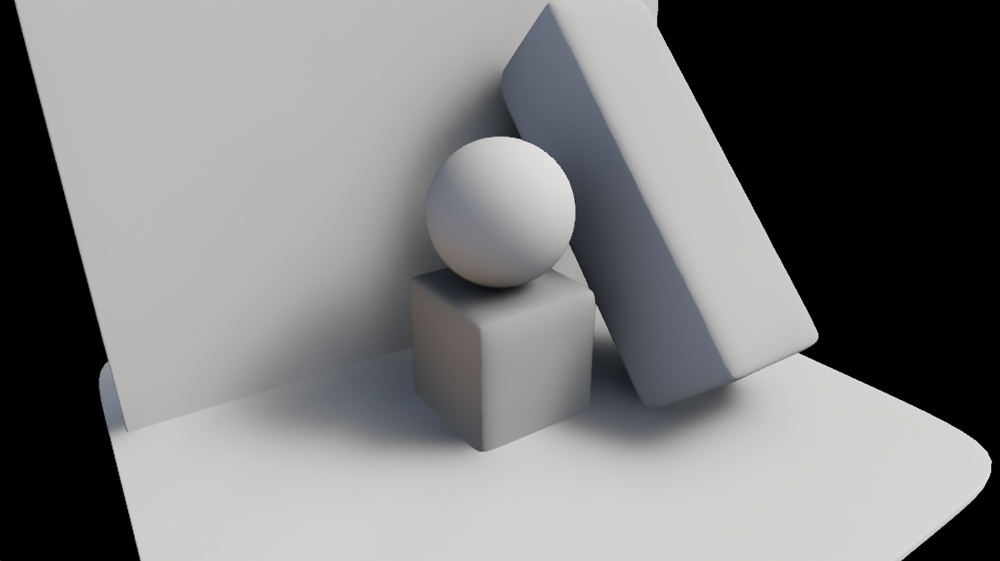
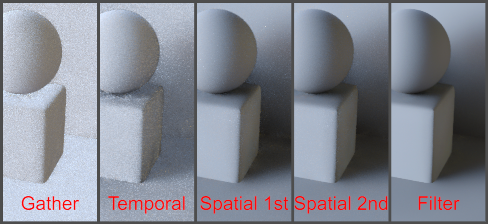
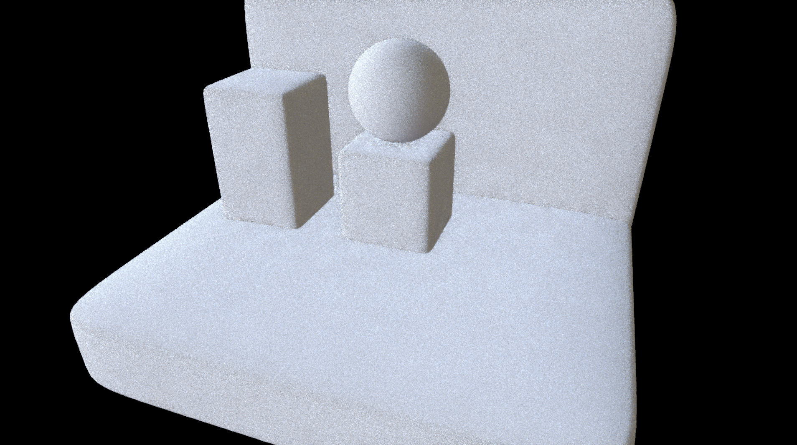
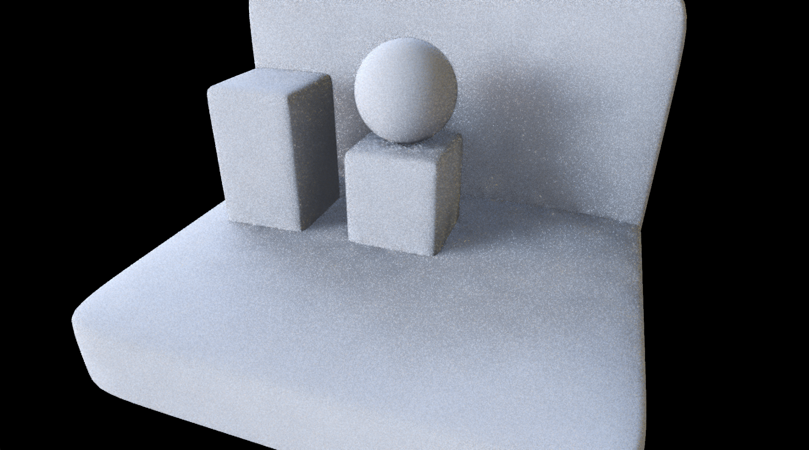
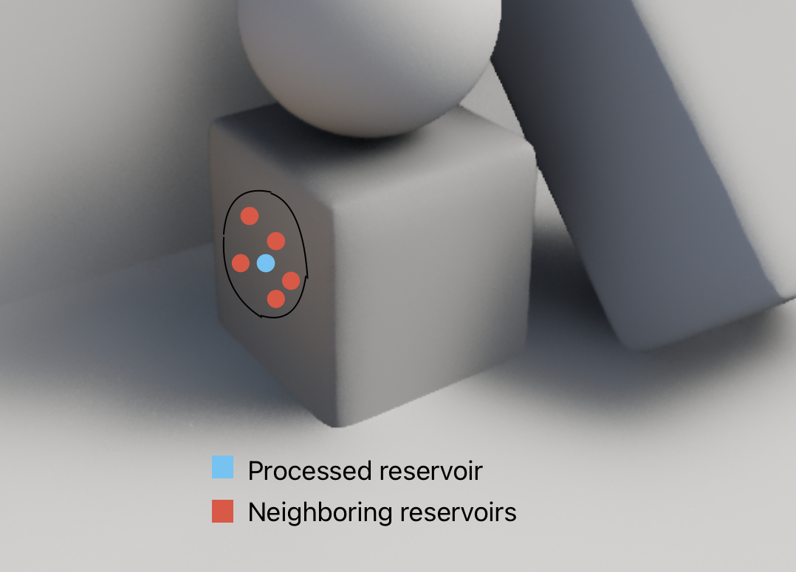
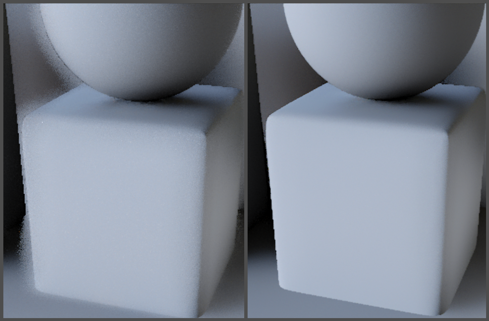
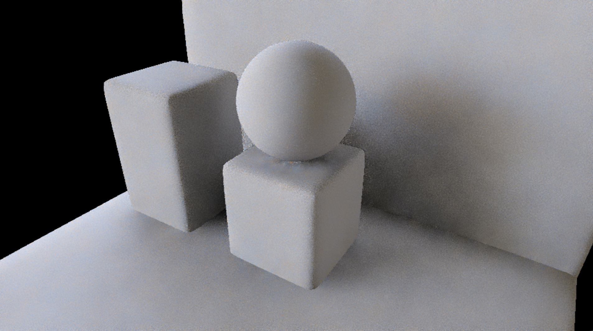

# Diffuse



The indirect diffuse computation follows these main steps:

- Sample gathering (half-res)
- Sample weighting and reservoir filling (half-res)
- Temporal reuse of the reservoirs (half-res)
- Reservoir weight clamping (half-res)
- First spatial reuse of the reservoirs (half-res)
- Second spatial reuse of the reservoirs (half-res)
- ReSTIR resolve (full-res)
- Temporal filtering (full-res)



## Sample gathering (half-res)
( shader: restir.gather_samples_and_temporal_reuse_DIF.jxs )



The indirect diffuse computation starts by gathering color samples. The gathering is performed in three ways:

### 1) Gathering samples from the viewport

Random pixels are sampled from the Previous-frame composited image. The random distribution is uniform, and all pixels have the same propability of being sampled. If the sampled pixel is in the background (depth = 1), it's discarded.

>[!NOTE]
> We could ray-trace from the G-Buffer to find intersections with the on-screen geometry; since ReSTIR is all about postponing visibility checks, i'm currently collecting light samples from the texture directly, without worring about them being visible, and skipping costly ray-tracing operations. Visibility is checked only later on. Moreover, since the ray marching happens in screen space, visibility checks are performed by taking a limited number of steps along the ray, making the operation much lighter than world-space ray tracing.

### 2) Gathering samples from a selection of the brightest pixels

To increase the chances of gathering significant (bright) samples, i'm performing a selection of the brightest pixels prior to sampling. The selection is performed by comparing four pixels within 2x2 tiles, and retrieving the brighntess and the texture coordinates of the brightest pixels. The selection involves some randomness to keep the choice unbiased - brighter pixels have a higher chance of being selected. The output texture is then downscaled by a factor of 2. The process is repeated several times, ending with a selection of a handful of very bright pixels. This works as a sort of pre-selection of the best candidate pixels. 
( shaders: restir.calc_uv_and_luma.jxs, and restir.find_brightest_pixel.jxs )

>[!NOTE]
> We can't just use these bright pixels as sampling source because potentially they might be occluded, and therefore not contribute to illumination.

### 3) Gathering samples from the environment map

Random pixels are samples from an environment map. The samples are taken by shooting uniformely distributed rays within the normal-oriented hemisphere. Once again, no ray tracing operation is performed to compute occlusion, as visibility checks are postponed. The environment texture has been mipmapped prior to sampling, and the samples used for the indirect diffuse component are taken from the second mip level (LoD = 1). Althoug incorrect for rigorous path tracing, sampling from a higher mip level reduces variance significanly (hence noise), and speeds up convergence.

>[!WARNING]
> The level of detail (LoD) could be made dynamic. Setting LoD = 1 helps reduce noise but leads to softer, less defined shadows. Given the availability of an occlusion map, I plan to experiment with selecting a lower mip level for partially occluded fragments, such as those in concave corners. These semi-occluded areas require higher sample variance for better accuracy.

>[!WARNING]
> Sampling directions are uniformely distributed within the normal-oriented hemisphere and generated using a white noise. As the original ReSTIR paper suggests, i'm not importance-sampling directions (e.g. using cosine-weighted sampling). It may be worth trying other random generation strategies, such as blue noise or low-discrepancy sequences to see if convergence speed increases.

## Sample weighting and reservoir filling

Once a sample is taken, the first step consists in computing radiance (assuming the sample is visible from the shaded point). Radiance is computed considering samples's color and direction (with respect to surface normal), surface albedo, and the PDF choosen for sampling:

```glsl
// compute radiance for a sample taken from the viewport
vec3 get_radiance(in sample this_s, in sample test_s){

	//compute view-space light direction
	vec3 diff = test_s.pos - this_s.pos;
	vec3 dir = normalize(diff);

	//compute lambert
	float lambert = max(0.0, dot(this_s.nor, dir));
	float PDF = 1 / TWOPI;
	return this_s.alb * lambert * test_s.col / PDF;										
}

// compute radiance for a sample taken from the environment map
vec3 get_radiance_for_env(in sample this_s, in sample test_s){

	// test_s.nor holds the samplign direction in case of environment sampling
	float lambert = max(0.0, dot(this_s.nor, test_s.nor));
	float PDF = 1 / (2*M_PI);
	return this_s.alb * lambert * test_s.col / PDF;							
}
```

Once radiance has been computed, a weight is assigned the sample:

```glsl
[...]
//weight of the sample
p_hat = luminance( get_radiance(this_s, test_s) );
[...]
```
The weighting function (here called luminance) computes weighting as:

```glsl
float luminance(vec3 x){ return length(x); }
```

After weighting, the sample is inserted into the reservoir. Reservoirs contain 4 elements, and are stored as 4-component vectors. Mirroring the original ReSTIR paper, the elements in the reservoir vectors are the following:

- reservoir.x = sum of the weights; the weight of each sample is added to the total weight of the reservoir.
- reservoir.y = index of the selected sample; 
- reservoir.z = number of samples processed by the reservoir so far.
- reservoir.w = weight of the selected sample; 

Each sample must be identified by a single value to keep reservoirs packed into a vec4 for convenience. To make this happen, i'm using two utility funtions to transform texture coordinates into indexes and back:

```glsl
int uv2index(in vec2 uv){
	uv = floor(uv);
	return int(uv.x + uv.y*texDim.x);
}

vec2 index2uv(in int i){
	return vec2( mod( float(i), texDim.x ), floor( float(i) / texDim.x ) ) + 0.5;
}
```

At the beginning of the sampling phase, the reservoirs are initialized to vec4(0,0,0,0);

To add a new sample into the reservoir, the function "update_reservoir" is called. This function is used both to add single samples to the reservoir and for merging two reservoirs together:

```glsl
vec4 updateReservoir(	vec4 reservoir, /*reservoir to update*/
						float lightToSample, /*index of the sample to add to the reservoir*/
						float weight, /*sample's weight*/
						float c, /*length of the reservoir that's been merged with this reservoir (=1 in case of a single sample) */
						uint seed, /*RNG seed*/
						in vec3 candidate_dir, /*sample's direction (in case of samples from the environment) */
						out vec3 best_dir /*direction of the most significant sample (in case of samples from the environment) */
					)
{

	// Algorithm 2 of ReSTIR paper
	reservoir.x = reservoir.x + weight; // r.w_sum
	reservoir.z = reservoir.z + c; // r.M

	// change the favourite sample using a weighted probability
	if (RandomFloat01(seed) < weight / reservoir.x) {

		if(lightToSample >= 0){ //If the sample comes from the viewport
			reservoir.y = lightToSample; // r.y
		} 		
		else{ //If the sample comes from the environment map
			reservoir.y = -1;
			best_dir = candidate_dir;
		}
	}	
	return reservoir;
}
```

In case the sample comes from the viewport, the index of the sample is >= 0; if the sample comes from the environment map instead, the index of the sample is always -1. In case of a sample from the environment, the candidate sample, and the sample currently held by the reservoir are stored using 2 vec3 variables, "candidate_dir" and "best_dir".


>[!NOTE]
> I'm indexing environment samples using the world space direction used for samplig the cubemap. This is because it was tricky to use a single value to represent a specific position on the cube map.

>[!WARNING]
> I'd like to rework this, and try to figure out a way to index environment samples using a single (negative) value. This would allow to save memory (we wouldn't have to pass another texture around, because everything would have been packed into a vec4 reservoir).

## Temporal reuse of the reservoirs (half-res)



After the samples have been collected, the resevoirs from the previous frame are merged with the current reservoirs. A relative motion between the camera and the objects in the scene may have occured from one frame to the next, so reservoirs are temporally reprojected using velocity vectors. If reprojection fails (whether because the fragment was outside the viewport at the previous frame, or because it has just been disoccluded), the reservoir merging is skipped.
Prior to merging, the samples in the previous-frame reservoirs are re-weighted to update their "importance".

>[!NOTE]
> During temporal reuse, the length of the reservoir (reservoir.z) gets clamped to 20, as suggested by the original ReSTIR paper. This avoids having too-long reservoirs, which may become "stagnant", and react slower to the changes in the scene.

After merging, the reservoirs are validated. A "shadow ray" is shot from the shaded point toward the sample held by the reservoir to confirm/disprove that the sample is still visible. Shadow rays are traced in screen-space usign a large marching step.

>[!NOTE]
> There's no reason to use fine-stepped ray marching, since we're not interested in what the ray intersects and where, but just if there's something between the shaded pixel and the sample.

Shadow rays are traced using the functions in restir.raytrace.glsl.

## Reservoir weight clamping (half-res)

After temporal reuse, reservoirs go trough a process of weight clamping (see shader restir.clamp_reservoir_weight.glsl).

```glsl
	vec4 reservoir = texelFetch(tex0, ivec2(jit_in.uv));

	float maximum = -1;
	maximum = max(maximum, texelFetch(tex0, ivec2(jit_in.uv) + ivec2(-width, -width)).w);
	maximum = max(maximum, texelFetch(tex0, ivec2(jit_in.uv) + ivec2(+0, -width)).w);
	maximum = max(maximum, texelFetch(tex0, ivec2(jit_in.uv) + ivec2(+width, -width)).w);
	maximum = max(maximum, texelFetch(tex0, ivec2(jit_in.uv) + ivec2(-width, +0)).w);
	maximum = max(maximum, texelFetch(tex0, ivec2(jit_in.uv) + ivec2(+width, +0)).w);
	maximum = max(maximum, texelFetch(tex0, ivec2(jit_in.uv) + ivec2(-width, +width)).w);
	maximum = max(maximum, texelFetch(tex0, ivec2(jit_in.uv) + ivec2(+0, +width)).w);
	maximum = max(maximum, texelFetch(tex0, ivec2(jit_in.uv) + ivec2(+width, +width)).w);

	outColor.rgb = reservoir.xyz;
	outColor.a = min(reservoir.w, maximum*1.5);
```

This shader finds the maximum sample weight among neighboring reservoirs - the maximum (augmented by 1,5) is used to limit the weight of the processed reservoir.

>[!NOTE]
> Weight clamping is used to reduce fireflies. See https://en.wikipedia.org/wiki/Fireflies_(computer_graphics)

## First spatial reuse of the reservoirs (half-res)


The next step is to combine reservoirs spatially. From the processed reservoir, we draw a disk oriented according to the surface normals. Within this disk, we randomly access and merge the neighboring reservoirs (restir.spatial_reuse_1st_DIF.jxs). 



No reservoir validation is performed on the individual merged reservoir, on the assumption that fragments visible from the current position are likely visible from neighboring positions as well. Neighboring reservoirs are sampled within a normal-oriented disk, as fragments with similar orientations (normals) to the current fragment are more likely to contain valuable samples. This approach increases the likelihood of finding important contributions. Prior to merging, samples are re-weighted, like we did with temporal reused reservoirs.

>[!WARNING]
> The weighting function is length(radiance). While this is ideal, length() functions are slow because they involve a square root computation. In some ReSTIR implementations i saw, the weight computation is performed using luminance(radiance). It may be worth trying substitute the weighting function with a lighter luminance computation, especially in spatial reuse, where many weights must be computed.

The sampling pattern follows a spatio-temporal blue noise distribution, ensuring uniform yet randomized coverage across both space and time.

Neighboring reservoirs are excluded from merging with the current reservoir if their normals differ significantly or if they are too far apart.

```glsl
if(dot(this_s.nor, candidateNorDepth.xyz) < 0.95 || length(this_s.pos - candidatePos) > 0.3) continue;
```

The disk's search radius is influenced by the occlusion map—highly occluded fragments use a smaller radius compared to unoccluded ones.

>[!NOTE]
> In occluded regions, such as concave corners, high sample variance occurs, making it unnecessary to access distant reservoirs that are likely to be rejected due to incompatible surface normals.

The first spatial reuse accesses 8 neighboring reservoirs.

By the end of the process, the reservoir is validated, tracing a shadow ray towards the sample to check if something is in the way.

>[!WARNING]
> I'm using more reservoir validations than probably needed; at the moment, i'm trying to put everything in, and then see where we can cut some corners

## Second spatial reuse of the reservoirs (half-res)


After the first spatial reuse, a second follows. The mechanics are exactly the same, but this reuse pass uses 5 neighboring reservoirs only and a smaller search radius (restir.spatial_reuse_2nd_DIF.jxs).

After this second spatial reuse of the reservoirs, wight clamping is applied again to enruse no super bright samples produces fireflies.

The output of this pass is sent to the resolve pass and fed back for temporal reuse at the next frame.

## ReSTIR resolve (full-res)

Finally, we should have some reservoirs holding the best possible samples.
The resolve pass transforms these samples into actual colors, which are rendered on screen. This step is performed at full resolution.

For the indirect diffuse component, the resolve pass (restir.resolve_DIF.jxs) uses four reservoirs to determine the color of each pixel. A normal-oriented disk is drawn again, randomly accessing four reservoirs, including the current one. The search radius is once again influenced by the occlusion map and the reservoirs are chosen following a spatio-temporal blue noise distribution. Unlike the spatial reuse pass, neighboring reservoirs with differing normals or positions are not outright rejected. Instead, a weight is assigned to each sample based on orientation and positional differences. Before averaging colors, each contribution is scaled by its respective weight.



This picture shosw the difference without and with weighting.

The indirect diffuse component is divided by the albedo value of each fragment to de-modulate colors from albedo. This facilitates subsequent filtering operations. Albedo is added back at compositing stage.

## Temporal filtering (full-res)



The render colors are filtered using a temporal filter (restir.temporalFilter_DIF.jxs). Colors are accumulated over frames, reprojecting the fragments' positions using velocity vectors. To avoid ghosting artifacts, history colors are rectified by clipping their colors within the minimum and maximum values of the neighboring pixels. Local statistics (mean variance and squared variance) are used to determine the size of the "clipping box". The param "variance_clipping_gamma" makes the clipping more or less severe.

```glsl
//COLOR CLIPPING
ivec2 iuv = ivec2(jit_in.uv);
vec3 NearColor0 = texelFetch(imgTex, iuv + ivec2(1, 0)).rgb;
vec3 NearColor1 = texelFetch(imgTex, iuv + ivec2(0, 1)).rgb;
vec3 NearColor2 = texelFetch(imgTex, iuv + ivec2(-1, 0)).rgb;
vec3 NearColor3 = texelFetch(imgTex, iuv + ivec2(0, -1)).rgb;
		
// Compute the two moments
vec3 M1 = c.col + NearColor0 + NearColor1 + NearColor2 + NearColor3;
vec3 M2 = c.col * c.col + NearColor0 * NearColor0 + NearColor1 * NearColor1 
	+ NearColor2 * NearColor2 + NearColor3 * NearColor3;
		
vec3 MU = M1 * 0.2;
vec3 Sigma = sqrt(M2 * 0.2 - MU * MU) * variance_clipping_gamma;
		
vec3 BoxMin = MU - Sigma;
vec3 BoxMax = MU + Sigma;

prev p;
p.col = texture(accumTex, c.repUV).rgb;
p.col = clamp(p.col, BoxMin, BoxMax);

outCol.rgb = mix( p.col, c.col, c.weight );
```

After temporal filtering, the diffuse component is ready to be composited with the specular component.

>[!WARNING]
> I'd like ReSTIR to inform temporal filtering - since i'm validating previous frames reservoirs through ray tracing operations, history colors could be discarded a priori without the need to rectify them.