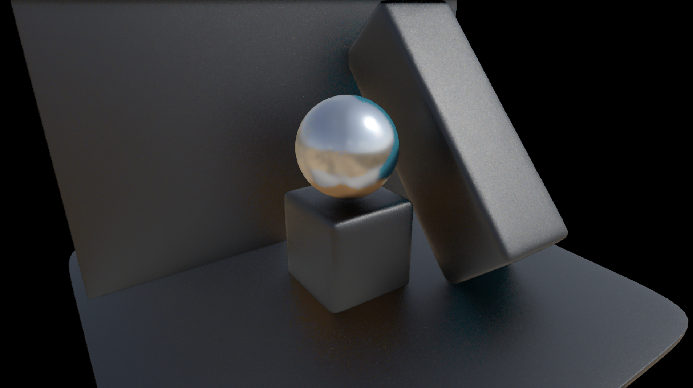

# Indirect Specular



Reflections are computed similarly to indirect diffuse, but special attention is paid on the PDF from which candidate samples are drawn.

Reflections computation includes the following steps:
- Sample gathering (half-res)
- Temporal reuse of the reservoirs (half-res)
- Spatial reuse of the reservoirs (half-res)
- ReSTIR resolve (full-res)
- Temporal filtering (full-res)

## Sample gathering (half-res)
( shader: restir.gather_samples_and_temporal_reuse_REF.jxs )

Samples are gathered differently than the diffuse pass - instead of picking random samples from the viewport and from the environment map, the gathering process is based on screen-space ray tracing. From the shaded point, a ray is generated in a directions determined by the microfacet NDF (more on that later). The ray tracing consists in marching along the ray in screen-space to find intersections with the visible geometry. If the ray intersects the geometry, a sample is taken from the viewport at the corresponding location; if no intersection is found (the ray exits the screen without intersecting anything), the environment map is sampled instead.

>[!NOTE]
> Reflections are more directional than the lambertian component of the BRDF, therefore the most solid method i experimented to gather useful samples was to ray trace the scene. I'm currently gathering just one sample per frame because the ray tracing operation is quite costly.

### The PDF for reflections

To determine the ray direction for reflections, I refer to microfacet theory. Here’s a quick recap:

From the perspective of microfacet theory, a pixel cannot be represented by a single surface orientation. Instead, it represents a "patch" of microscopic surfaces, each with its own unique orientation. The variation in these facet orientations is governed by a roughness parameter, which controls the divergence of their normals. Since individual facet normals cannot be computed analytically, they are represented statistically.

The distribution of facet orientations is described by a normal distribution function (NDF), which specifies the likelihood of a facet facing a particular direction. 

To generate coherent ray directions, i'm importance sampling the NDF of the microfacets. The NDF distribution model i'm using is the GGX distribution of Visible Normals (GGX VNDF). More on this topic here: https://jcgt.org/published/0007/04/01/paper.pdf, https://schuttejoe.github.io/post/ggximportancesamplingpart2/, https://www.youtube.com/watch?v=MkFS6lw6aEs. 

To maximize convergence time, the random sampling cycles through the first 64 elements of the quasi-random sequence Halton (2,3). For each pixel, the sequence starts from a different random index, and the sampling kernel is randomly rotated. 
See the shader restir.BRDF.glsl to take a look at the functions used to sample the NDF.

Once a sample is found, it gets weighted. Weighting reflection samples is different than weighting diffuse samples. This is the function used for weighting (contained inside restir.common.glsl), which uses a pretty standard PBR shading model:

```glsl
vec3 get_specular_radiance(in sample this_s, in sample test_s){

	vec3 diff = test_s.pos - this_s.pos;
	float dist2 = dot(diff,diff);
	float dist = sqrt(dist2);

	vec3 F0 = mix(vec3(0.04), this_s.alb, vec3(this_s.met)); 

  	vec3 L = diff / dist;
 	vec3 V = -this_s.view;
	vec3 H = normalize(V + L); 

	float NoV = clamp(dot(this_s.nor, V), 0.001, 1.0);
	float NoL = clamp(dot(this_s.nor, L), 0.001, 1.0);

	float NoH = clamp(dot(this_s.nor, H), 0.001, 1.0);
	float HoV = clamp(dot(H, V), 0.001, 1.0);

    float alpha_sqr = this_s.rou * this_s.rou;

	//Masking function
	float NoV_sqr = NoV*NoV;
	float lambdaV = (-1.0 + sqrt(alpha_sqr * (1.0 - NoV_sqr) / NoV_sqr + 1.0)) * 0.5;
	float G1 = 1.0 / (1.0 + lambdaV);

	//Height Correlated Masking-shadowing function
	float NoL_sqr = NoL*NoL;
	float lambdaL = (-1.0 + sqrt(alpha_sqr * (1.0 - NoL_sqr) / NoL_sqr + 1.0)) * 0.5;
	float G2 = 1.0 / (1.0 + lambdaV + lambdaL);


	//Fresnel
   	vec3 F = F_schlick(HoV, F0);
    
    //Estimator
    //Fresnel * Shadowing
    //Much simpler than brdf * costheta / pdf heh
    vec3 estimator = F * (G2 / G1);

    //Output
    return estimator * test_s.col;
}
```

After weighting, the sample is inserted into a reservoir.

## Temporal reuse of the reservoirs (half-res)

As with the diffuse component, the reservoirs from the previous frame are merged with those from the current frame. If temporal reprojection is valid, the candidate from the history reservoir is re-weighted in the current frame, and the reservoirs are combined.

For reflections, the reservoir length is limited to 4, resulting in a relatively short reservoir. While this shorter length offers less temporal stability, it allows the reflection computation to respond more quickly to sudden changes in the scene.

>[!NOTE]
> Reflections are strictly view-dependent, therefore any minor change in the camera's position or direction can invalidate the samples. For this reason, i'm not relying on long reservoirs. Still, there's some tangible gain in convergence also with short reservoirs.

Reservoirs are fed back into the temporal reuse pass. Differently from the indirect diffuse component computations, the feedback point isn't after the spatial reuse, but before it.

## Spatial reuse of the reservoirs (half-res)
(shader: restir.spatial_reuse_ref.jxs)

After temporal reuse, the reservoirs are combined spatially. In this pass, samples are not drawn within a normal-oriented disk but instead within the projection of the specular lobe. The search radius for spatial reuse is influenced by the material's roughness—smooth materials use a very small radius, while rough materials utilize larger radii.

The rejection criteria are the same as the diffuse spatial reuse pass (normals equality and distance).

## ReSTIR resolve (full-res)
(shader: restir.resolve_REF.jxs)

The resolution pass is very similar to the one used for the diffuse compoent. The differences are:
- The resolve pass for reflections uses 8 samples instead of 4.
- Occlusion is no longer taken into account.
- The radius for looking up samples into neighboring reservoirs is affected by roughness.
- Instead of a normal-oriented disk, neighboring reservoirs are sampled by projecting the specular lobe in screen-space and sampling from within it.

>[!WARNING]
> Currently i'm always reading samples from 8 reservoirs. The number of averaged samples could be made proportional to material's roughness, with high-roughness materials needing more samples to average, and low-roughness material just a few or one.

Like with diffuse, the resulting color isn't modulated by albedo to optimize the next filterning stage. 

## Temporal filtering (full-res)

Temporal filtering is applied following the same exact algorithm as the diffuse component. The only difference regards velocity vectors. 

Velocity vectors are very useful to reproject the diffuse component, but less than ideal for temporally reproject reflections. To the temporal filtering pass i'm providing two distinc sets of velocity vectors - one coming from the render target, and one specifically crafted for reprojecting reflections. The method i've followed to implement reliable velocity vector for reflections is this:
https://sites.cs.ucsb.edu/~lingqi/publications/rtg2_ch25.pdf

>[!WARNING]
> The framework in which this method is applied is quite different from ours. I tried adapring the method to work in our context with mixed results. I'll go more into the details of what's not working in the final section.

In the temporal filter, i'm sampling color history using both sets of velocity vectors, and i'm blending colors according to local staistics (mean, and squared variance). This method is called "Dual-source reprojection", and has been used both in the "Pica Pica" game, and in the Kajiya renderer.

>[!WARNING]
> Once again, i'm getting mixed results with this kind of temporal reprojection. While it effectively improves temporal coherence for very smooth materials and very rough materials, it's unclear how to balance it with medium-roughness materials.
