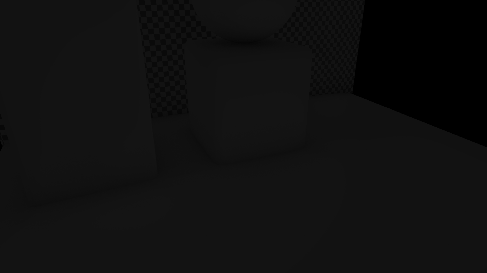

# Compositing


The compositing stage is pretty straightforward. (shader restir.composite.jxs)

```glsl
	ivec2 iuv = ivec2(jit_in.texcoord);

	//Read the textures to composite
	vec3 img = texelFetch(imgTex, iuv).rgb; //Direct lighting
	vec3 ind = texelFetch(indTex, iuv).rgb; //Indirect diffuse
	float occ = texelFetch(occTex, iuv).r; //Occlusion map
	vec3 alb = texelFetch(albTex, iuv).rgb; //Albedo
	vec3 spe = texelFetch(speTex, iuv).rgb; //Indirect specular
	vec2 rouMet = texelFetch(rouMetTex, iuv).xy; //Roughness - metalness
	vec4 lookup = texelFetch(bkgTex, iuv); //Background (environment) and Fresnel amount
	vec3 bkg = lookup.rgb;
	float F = lookup.a;

	vec3 res = img;
	res += alb*occ*0.005; //add a touch of uniform ambient light
	ind *= alb; //modulate indirect by albedo
	res += ind; //add indirect

	res *= 1.0 - rouMet.y;	//nullify diffuse if metallic
	res += spe; //Add specular

	//Feed back the result to be used as source of indirect illumination for the next frame
	//Feeding back reflections is wrong, because they're view dependent; still feeding them together with diffuse allows for inter-reflections, which, although wrong, look better than no inter-reflection at all.
	outFdbk.rgb = res;
	outFdbk.a = 1.0;

	res += bkg; //add background environment

	outColor = vec4(res, 1.0);
```

>[!NOTE]
> I'm adding a small amount of uniform ambient light, obscured by the occlusion map. The ambient light is so weak that it's unnoticeble; still, when the image is completely dark (no direct illumination reaches the objects in the scene), it's enough to make the ReSTIR algorithm work.


Ambient light only