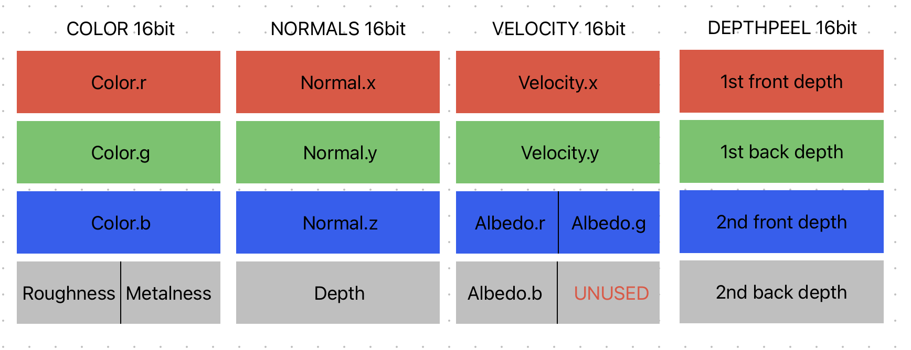

# Limitations, issues and future work

The "gi" pass is far from being perfect, but there should be room for improvement. This is a list of the critical aspects of the current state of the algorithm, arranged by cathegory.

# Known issues

## Blackouts

The rendering occasionally becomes abruptly unstable, causing black areas to appear on the screen. The only way to resolve this is by re-instantiating the pass or quickly moving the camera around. After recent updates to the "gi" algorithm, these blackouts have become significantly less frequent, but they still occur unpredictably.

I do not yet have a precise understanding of the root cause, so I am unable to fully resolve the issue. However, I suspect the problem lies in the part of the algorithm responsible for computing reflections, as rendering only the diffuse component has never caused this artifact to appear. The nature of the artifact suggests a potential division by zero or faulty memory access somewhere in the code. Additionally, the spatio-temporal reservoir reuse mechanism seems to gradually "spread" the black areas across the rendered image.

To identify and address the problem, I will need to use an analysis tool for a more detailed investigation. The issue appears to be related to changes in lighting conditions, such as moving lights or modifying the albedo color of objects, which can trigger the blackouts.

Currently, this remains the most critical limitation of the "gi" pass, as it makes the algorithm unreliable for real-world use cases.

## Unsupported TAA

In real-time sample-based rendering, TAA is useful not only for mitigating aliasing artifacts, but also for noise reduction. At the moment, enabling TAA after the "gi" pass produces visible color fluctuations. The reason for such artifacts should lie in the DEPTHPEEL target not being jittered - this produces depth values which are inconsistent with the rest of the rendered geometry, whch reflects in uncorrect ray tracing operations. Enabling projection matrix jittering for DEPTHPEEL should solve the issue.

## Unalligned environment map

It looks like the environment map shown in the background doesn't allign with reflection. 

## Diffuse - reflections order

Currently, i'm rendering reflections first, and then diffuse. There's absoutely no point in doing that! I'll reverse the order so that reflection can computed on the current-frame diffuse computation. This requires splitting the compositing stage in two: first, add direct and indirect diffuse, then compute reflections, then composite all together.

# Performance

This is not a single issue, but rather a collection of things that nagatively impact performance.

## Memory bandwidth

This seems to be the most significant performance bottleneck (as it quite always is with deferred rederers). The "gi" pass relies on multiple texture inputs, and passing large textures around put a lot of pressure on the GPU. Setting the bit depth of each individual texture and shader to the minimum acceptable value greatly speeds up the process. At the moment, i kept every input and shader at float32, willing to reduce the bit depth of each input and processing stage to see where we can save some memory.

Memory issues could be partially reduced by better packing render targets. Currently, we have some "free slots" in our render targets. This is the current setup:

There are many unused channels in the G-buffer. By packing small bit depth data into larger bit depth container, we could remove two render targets, saving a total of 64 bits of memory per pixel:

Still, the cost of packing/unpacking data must considered.

Moreover, the DEPTHPEEL render targets is used for ray-tracing operations only, which happen at half-resolution - I'd like to try rendering such target at half-res directly, to cut it's memory footprint to a quarter, and to improve the performance of the depth-peeling process itself.

On the same line, i'm storing the index of the samples from the environment as a direction. This consumes 3 channels of a texture and forces us to use another output other than the reservoir texture. I'd like to try using a different method to store such indexes. For example, we could transform cartesian coordinates into polar coordinates, and use a single wrapped value to store the direction; this comes at the additional cost of encoding/deconding operations and probably a precision loss. Still, it may be worth it anyway (in particular for the diffuse component, where directional precision is not strictly necessary since we're fetching from LoD = 1).

There're many operations i keep repeating over and over, such as orthonormal basis computation - i wonder if it may be worth precomputing these common values and provide them using textures.

## Raytracing improvements

At the moment, raytracing is employed in reservoir validation and in sample gathering for reflections. Screen space raytracing happens by marching along a ray while depth testing like no-brainer. I'm already trying to avoid under/over stepping, but i think tracing operations could be greatly improved. I'd like to employ an acceleration structure to speed up the process, building a depth hierarchy storing the min and max depths into higher and higer texture mip levels. These are some resources that could help figuring out how to implement such an acceleration structure:
https://research.nvidia.com/sites/default/files/pubs/2015-08_An-Adaptive-Acceleration/AcceleratedSSRT_HPG15.pdf
https://selgrad.org/publications/2017_hpg_HBSS.pdf
https://sugulee.wordpress.com/2021/01/19/screen-space-reflections-implementation-and-optimization-part-2-hi-z-tracing-method/

Alternatively, it would be worth considering splitting the search for intersections into a coarse search, and a finer one, using again linear marching or binary search.

## Reducing validation tracing

Every frame, a "shadow ray" is traced to validate the previous frame reservoir (in the diffuse component computation). Shadow rays are traced using a very coarse step (about 50 taps per ray); still they might have an impact performance-wise. In many ReSTIR implementations i found, validation rays are usually limited, and not performed every frame, or every pixel. For example, the Kajiya renderer traces a validatioin ray every 3 frames; other ReSTIR based renderes, trace 1 validation ray per frame, but just for one out of four pixels. We could try to reduce the number or frequency of the validation rays to see if we can improve performance while mantaining good-looking results.

# Look

The "gi" pass could look better than it currently does. In particular, there are two inter-related aspects that could be improved:

## Noise

The ReSTIR algorithm is about noise reduction through fast convergence, but, of course, some noise in the rendered images is unavoidable. Further noise reduction can be achieved in two ways: finding better candidate samples for importance sampling, and improving filtering operations.

About finding good samples, the diffuse component is pretty much "okay". I tried my best to make clever reuse of the resrvoirs, and the rendered images are quite converged. Still, some critical areas undergo visible fluctuations - in particular, occluded areas are tough to stabilize. This is due to the high variance in such areas, which prevents the use of large radii for the spatial reservoir reuse (otherwise, small scale details would look blurry and be lost). I'd like to try addressing the issue by increasing the number of samples gathered for such areas, and make temporal filtering operations more sever where it's needed.

The specular component is the one more prone to noise. Although the directionality is much greater than the diffuse component, the lack of a reservoir's temporal reuse stage negatively affects the search for good candidate samples, which reflects in visible noise. The parameters used for spatial reuse and reservoir resolution must be further tweaked, and i think 

## Ghosting

Even with optimal reservoir reuse, noise is inevitable, making a color filtering stage essential. Ghosting is a common visual artifact associated with temporal filtering, often occurring when pixels become disoccluded and color history is not properly invalidated. Detecting when a pixel has been disoccluded can be approached in several ways. Currently, I am using the method described in the third section of this article, though it is not necessarily the most precise or only solution.

A more robust disocclusion criterion could be achieved by assigning a unique ID to each triangle and rendering these IDs as a color value. After the reprojection process, if the triangle's ID remains the same, temporal reprojection is considered valid, and the color history can be reused. If the ID changes, a disocclusion has occurred, and the color history for that pixel must be discarded. Implementing this approach would require a reliable method for assigning unique IDs to rendered triangles.

Ghosting can also occur without disocclusion, particularly when lighting conditions change abruptly. In such cases, ghosting artifacts can be mitigated by enforcing consistency between the current pixel and its neighbors. This color rectification process can be implemented through techniques such as color clamping or color clipping. The severity of this process can be adjusted depending on whether a pixel requires stronger color filtering or faster responsiveness to lighting changes.

Currently, color clipping is applied uniformly across the image. However, I plan to experiment with applying more aggressive temporal filtering to pixels in high-variance areas, such as occluded concave surfaces, where stronger filtering could be beneficial.

A critical aspect for preventing ghosting in general is to use reliable motion vectors.
